# Hyades

**LaTeX math as pure Unicode text.** For terminals, code comments, emails, and everywhere rich formatting isn't a thing.

<div align="center">
  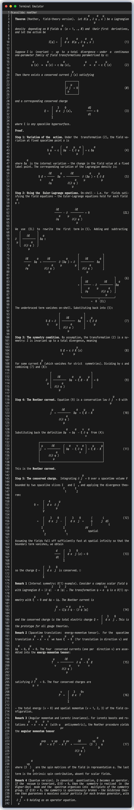
  <br>
  <sub>Every equation above is pure text -- you can select it and copy-paste it anywhere. The source is standard LaTeX.</sub>
</div>

<br>

## What Is This?

Hyades takes standard LaTeX math like this:

```latex
$$
  f(x) = \overbrace{\sum_{k=0}^{n} \frac{f^{(k)}(a)}{k!}
           (x-a)^k}^{\mathit{Taylor polynomial}}
       + \underbrace{R_n(x)}_{\mathit{Remainder}}
$$
```

and renders it as multi-line Unicode text:

```
             𝑇𝑎𝑦𝑙𝑜𝑟 𝑝𝑜𝑙𝑦𝑛𝑜𝑚𝑖𝑎𝑙
         ╭───────────┴───────────╮
           𝑛      (𝑘)
          ───    𝑓   (𝑎)         𝑘
  𝑓(𝑥) =  ╲     ───────── (𝑥 − 𝑎)  +   𝑅 (𝑥)
          ╱⎽⎽      𝑘!                   𝑛
         𝑘 = 0                       ╰───┬───╯
                                     𝑅𝑒𝑚𝑎𝑖𝑛𝑑𝑒𝑟
```

or plain ASCII if you ask it to:

```
           n      (k)
          ---    f   (a)         k
  f(x) =  \     --------- (x - a)  + R (x)
          /__      k!                 n
         k = 0
```

It's a native CLI binary written in pure C. As such it is extremely fast and doesn't require any additional dependencies.
Linux, MacOS, and Windows, and Web (WASM) are all supported out of the box.

[**Try it in your browser →**](https://apology-is-policy.github.io/hyades/) -- interactive WASM playground with tutorials and a full syntax reference. No installation required.

## Features

### Math -- 95% LaTeX compatible

Fractions, roots, integrals, summations, products, limits, matrices, piecewise functions, aligned equations, Greek letters, auto-scaling delimiters, overbrace/underbrace, accents, primes, binomial coefficients, extensible arrows, equation tags, you name it... Paste your existing LaTeX and it just renders.

<details>
<summary><b>Full math feature list</b></summary>

| Category | Commands |
|----------|----------|
| **Fractions** | `\frac`, `\dfrac`, `\tfrac` -- infinitely nestable |
| **Roots** | `\sqrt{x}`, `\sqrt[n]{x}` |
| **Big operators** | `\sum`, `\prod`, `\int`, `\iint`, `\iiint`, `\oint`, `\oiint` with limits |
| **Limits** | `\lim`, `\limsup`, `\liminf`, `\max`, `\min`, `\argmax`, `\argmin` |
| **Matrices** | `\pmatrix`, `\bmatrix`, `\Bmatrix`, `\vmatrix`, `\Vmatrix` -- `\begin{pmatrix}` syntax works too |
| **Cases** | `\cases{...}` -- piecewise functions |
| **Aligned** | `\aligned{...}` with `\intertext` and `\tag` |
| **Greek** | Full lowercase (`\alpha`–`\omega`) and uppercase (`\Gamma`–`\Omega`) |
| **Delimiters** | `\left`/`\right` auto-scaling, `\middle`, invisible `\left.\right\|`, `\big`–`\Bigg` sizing |
| **Accents** | `\hat`, `\bar`, `\tilde`, `\vec`, `\dot`, `\ddot`, `\acute`, `\grave`, `\breve`, `\check` |
| **Wide decorations** | `\overline`, `\underline`, `\overbrace`, `\underbrace`, `\overrightarrow`, `\widehat`, `\widetilde` |
| **Annotations** | `\overset`, `\underset`, `\stackrel`, `\boxed`, `\tag`, `\substack` |
| **Math fonts** | `\mathbf`, `\mathbb` (ℕℤℚℝℂ), `\mathcal`, `\mathfrak` (𝔄𝔅ℭ), `\mathsf` (𝖠𝖡𝖢), `\mathscr`, `\boldsymbol` (bold Greek 𝛂𝛃, bold ∇ → 𝛁) |
| **Relations** | `\leq`, `\geq`, `\neq`, `\ll`, `\gg`, `\prec`, `\succ`, `\approx`, `\equiv`, `\sim`, `\propto`, `\coloneqq`, `:=`, `\not` prefix |
| **Set theory** | `\in`, `\notin`, `\subset`, `\subseteq`, `\cup`, `\cap`, `\setminus`, `\emptyset` |
| **Logic** | `\forall`, `\exists`, `\neg`, `\land`, `\lor`, `\implies`, `\iff`, `\therefore`, `\because` |
| **Arrows** | `\rightarrow`, `\Rightarrow`, `\mapsto`, `\hookrightarrow`, `\xrightarrow{f}`, `\xleftarrow{g}` |
| **Number theory** | `\pmod`, `\bmod`, `\mid`, `\binom` |
| **Operators** | `\oplus`, `\otimes`, `\odot`, `\circ`, `\bullet`, `\star`, `\dagger`, `\ddagger` |
| **Functions** | `\sin`, `\cos`, `\log`, `\ln`, `\exp`, `\det`, `\ker`, `\gcd`, `\operatorname{...}` |
| **Layout** | `\phantom`, `\smash`, `\mathord`, `\mathbin`, `\mathrel` |
| **Compat** | `\displaystyle`, `\textstyle`, `\notag` accepted as no-ops -- paste LaTeX directly |

</details>

### Beyond math

- **Tables** -- `\table` with `\row`/`\col`, 6 frame styles (single, double, bold, rounded, dotted, none), padding, alignment, column spans
- **Lists** -- `\fancylist` builds a list using Markdown syntax
- **Layout** -- Flex-like `hbox`/`vbox` containers with auto/intrinsic/fixed-width children, horizontal and vertical alignment
- **Text formatting** -- `\textbf`, `\textit`, `\texttt`, `\verb|...|`
- **Paragraph layout** -- Justified text with novel monospace-optimal line breaking, or just vanilla left aligned; hyphenation
- **Rules** -- `\hrule`/`\vrule` with auto-sizing and smart automatic junction intersection
- **Macros** -- User-defined with parameters and variable scoping
- **Computation** -- Variables, arrays, loops, conditionals, lambdas -- a complete programming language with a stack-based instruction machine
- **ASCII mode** -- Full ASCII fallback for environments without Unicode
- **Syntax highlighting** -- For vscode, Helix, and Neovim
- **Inline error diagnostics** -- For vscode, Helix, and Neovim

## Installation

### Pre-built binaries

Download from [Releases](https://github.com/apology-is-policy/hyades/releases) (macOS, Linux, Windows), then run the install script:

```bash
# Linux / macOS
chmod a+x install.sh
./install.sh

# Windows (PowerShell)
.\install.ps1
```

The script will:

- Install hyades, cassilda, hyades-cmp, and add to PATH
  - Unix: `$HOME/.local/bin`
  - Windows: `$env:USERPROFILE\bin`
- Integrate into Helix and Neovim if installed
- Render documentation files at
  - Unix: `$HOME/.local/share/hyades/docs`
  - Windows: `$env:USERPROFILE\AppData\Local\hyades`
- Typeset something to verify the installation

<div align="center">
  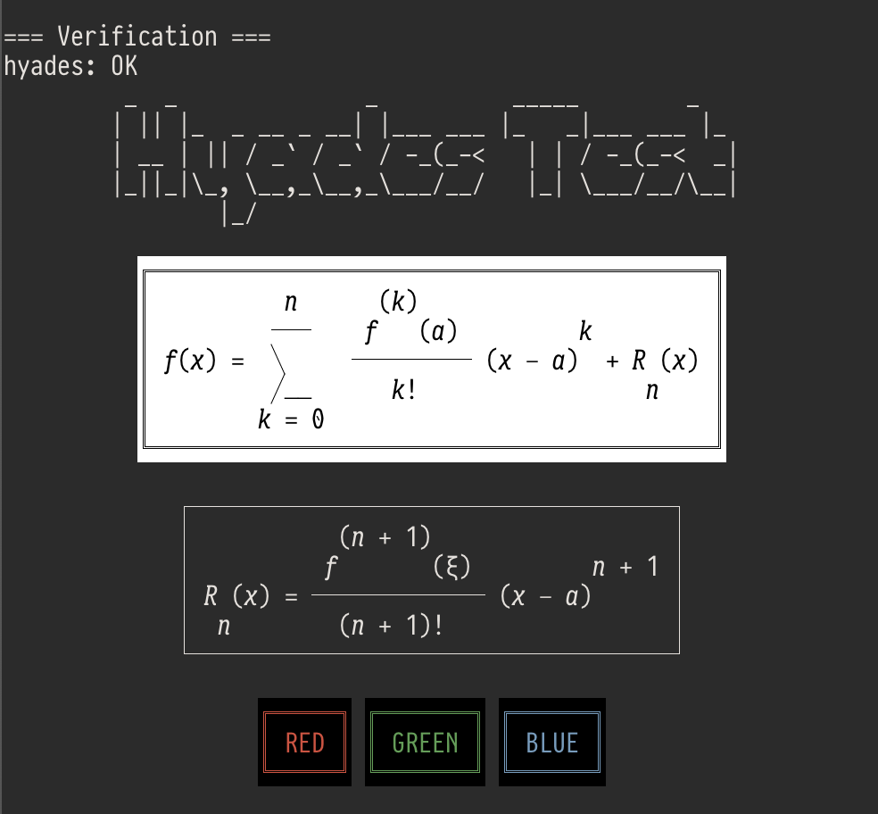
  <br>
</div>

This adds `hyades`, `cassilda`, and `hyades-mcp` to your PATH and integrates the tree-sitter grammar and LSP server into Helix and/or Neovim if installed.

### Build from source

```bash
cmake -B build -DCMAKE_BUILD_TYPE=Release
cmake --build build
# → build/hyades, build/cassilda
```

### Usage

```bash
# Render LaTeX from stdin
echo '$$\sum_{i=1}^n i^2$$' | hyades

# Render a source file
hyades equations.hy

# ASCII-only output
echo '$$\int_0^1 f(x) dx$$' | hyades --ascii

# Run an interactive-mode Hyades program
hyades -c matrix_rain.hy
```

## The two binaries

| | |
|---|---|
| **hyades** | Renders `.hy` source (or stdin) to stdout. Use for quick math, piping, code comments. |
| **cassilda** | Document processor for `.cld` files. Renders labeled sections in-place, to your code comments, or to stdout -- think Jupyter notebooks in plain text. |

```bash
# Render a labeled section to stdout
cassilda render notebook.cld section_name

# Process all sections in-place
cassilda process notebook.cld
```

## MCP server

An MCP server lets AI assistants render math expressions on the fly.

**Remote** -- no install, Cloudflare Worker:
```bash
# Claude Code
claude mcp add hyades --transport http https://hyades-mcp.apg.workers.dev/mcp

# Claude Desktop / Cursor / Windsurf -- add to config:
{ "mcpServers": { "hyades": { "url": "https://hyades-mcp.apg.workers.dev/mcp" } } }
```

**Local** -- offline, native binary (included in releases):
```bash
# Claude Code
claude mcp add hyades /path/to/hyades-mcp

# Claude Desktop / Cursor / Windsurf -- add to config:
{ "mcpServers": { "hyades": { "command": "/path/to/hyades-mcp" } } }
```


### Example: Reason with Claude about math in the terminal

<div align="center">
  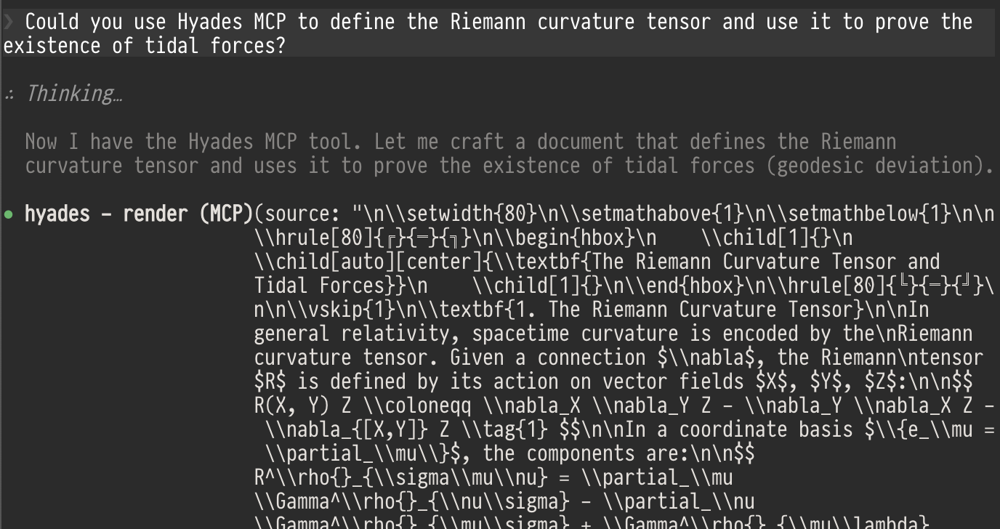
  <br>
</div>

<div align="center">
...<br>
  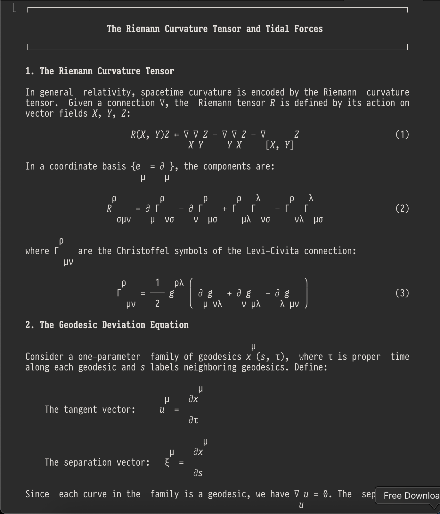
  <br>
</div>

<div align="center">
...<br>
  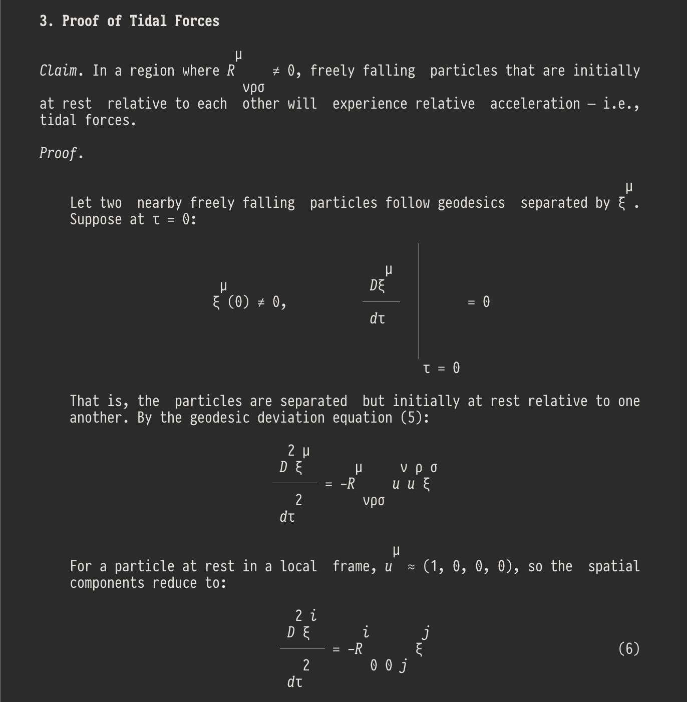
  <br>
</div>

<div align="center">
...<br>
  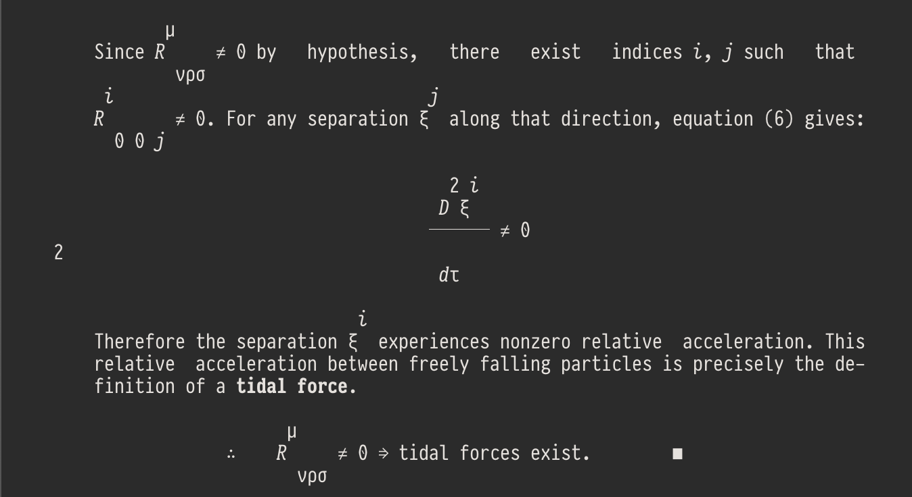
  <br>
</div>


## Editor support

The install script automatically configures any installed editors. Manual setup is also possible -- config files are in `editor-configs/` within the release.

**Helix** and **Neovim** get full integration out of the box:

- **Syntax highlighting** via tree-sitter (`.hy` and `.cld` files)
- **Error diagnostics** -- inline and in the gutter
- **Go-to-definition** -- jump to macro and label definitions
- **Hover** -- documentation pop-ups for commands and macros
- **Completions** -- context-aware suggestions
- **References** -- find all usages of a symbol

<div align="center">
  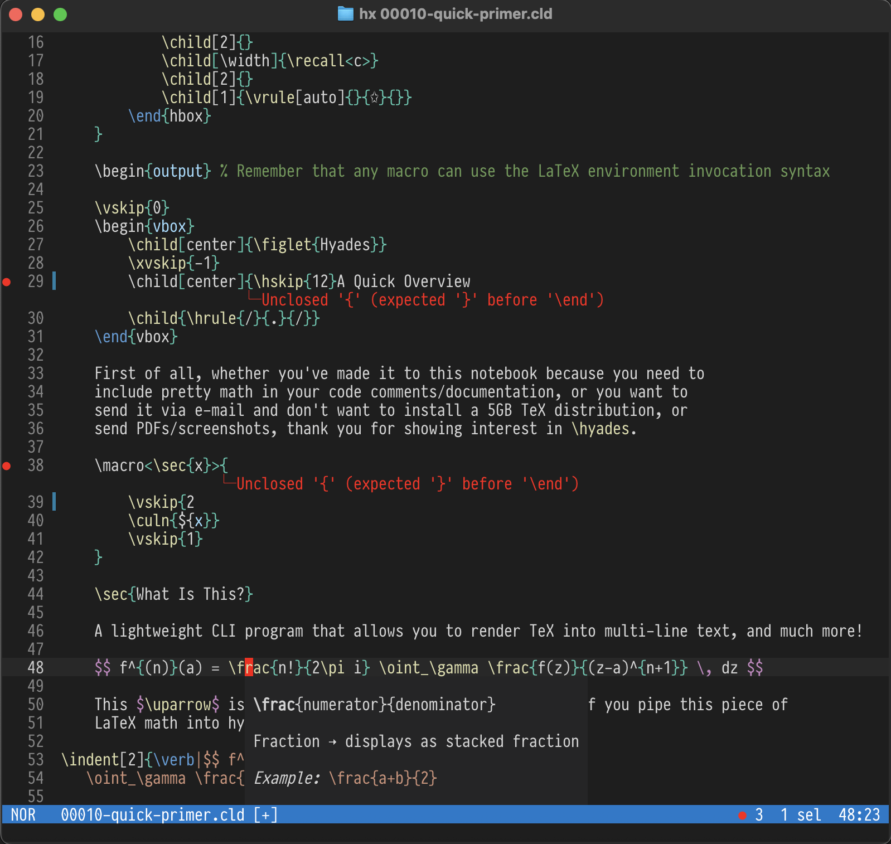
  <br>
  <sub>Hyades in Helix on MacOS (GhosTTY, font: PragmataPro Mono)</sub>
</div>
<br />
<br />
<div align="center">
  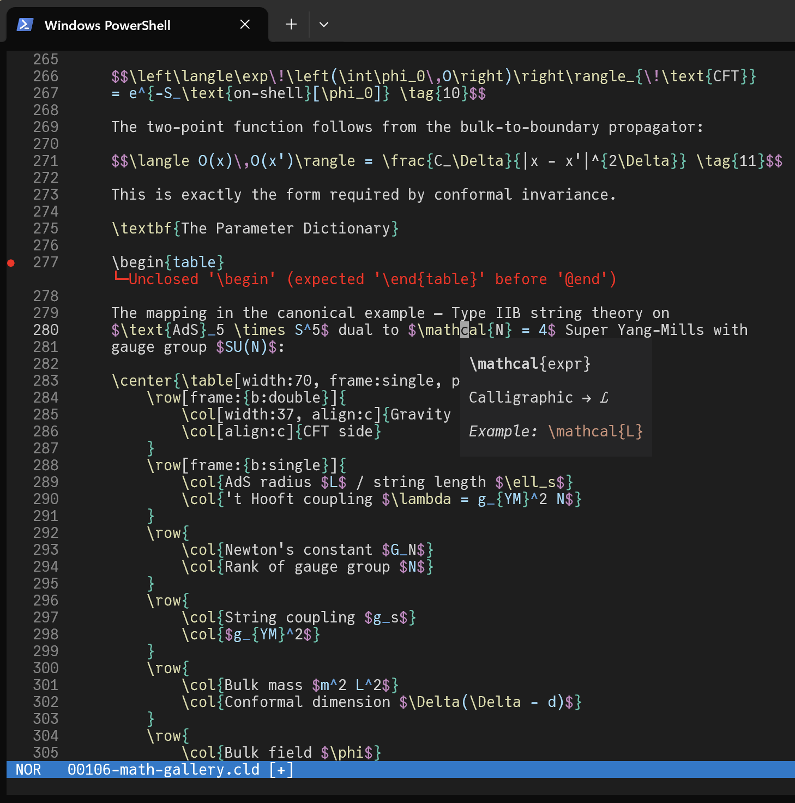
  <br>
  <sub>Hyades in Helix on Windows (font: JuliaMono)</sub>
</div>
<br />
<br />

A **VS Code extension** is also available. (I'm yet to polish and publish it, should be a matter of days.)

## Beyond all this

Hyades has an bytecode compiler and a stack-based VM (called Subnivean), which allows you to write
pretty much any computational code to support your macros and rendering. Two fun examples are included
in the release package. The first is the Matrix code effect for the terminal

<div align="center">
  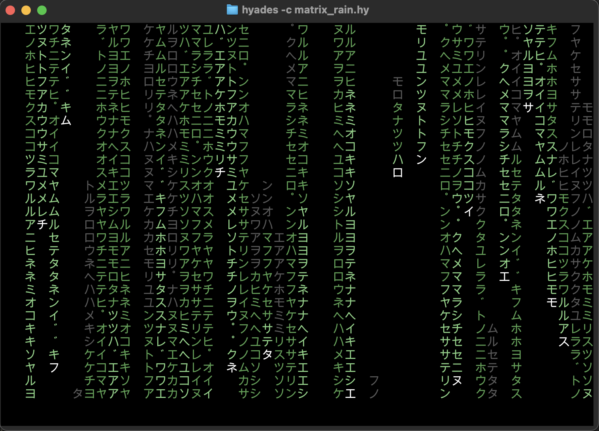
  <br>
</div>

And the second one is interactive Game of Life

<div align="center">
  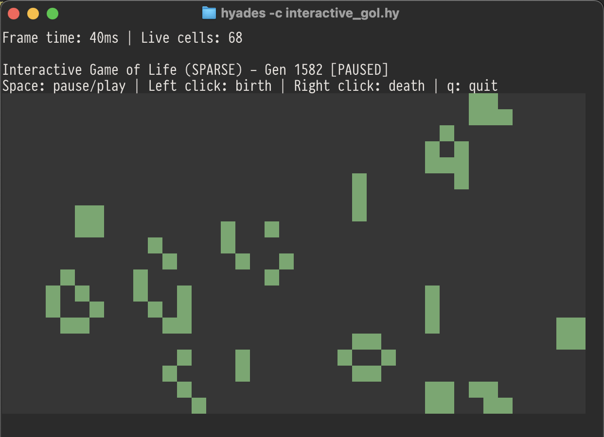
  <br>
</div>

Which is also a direct proof of Hyades' Turing-completeness.

<div align="center">
  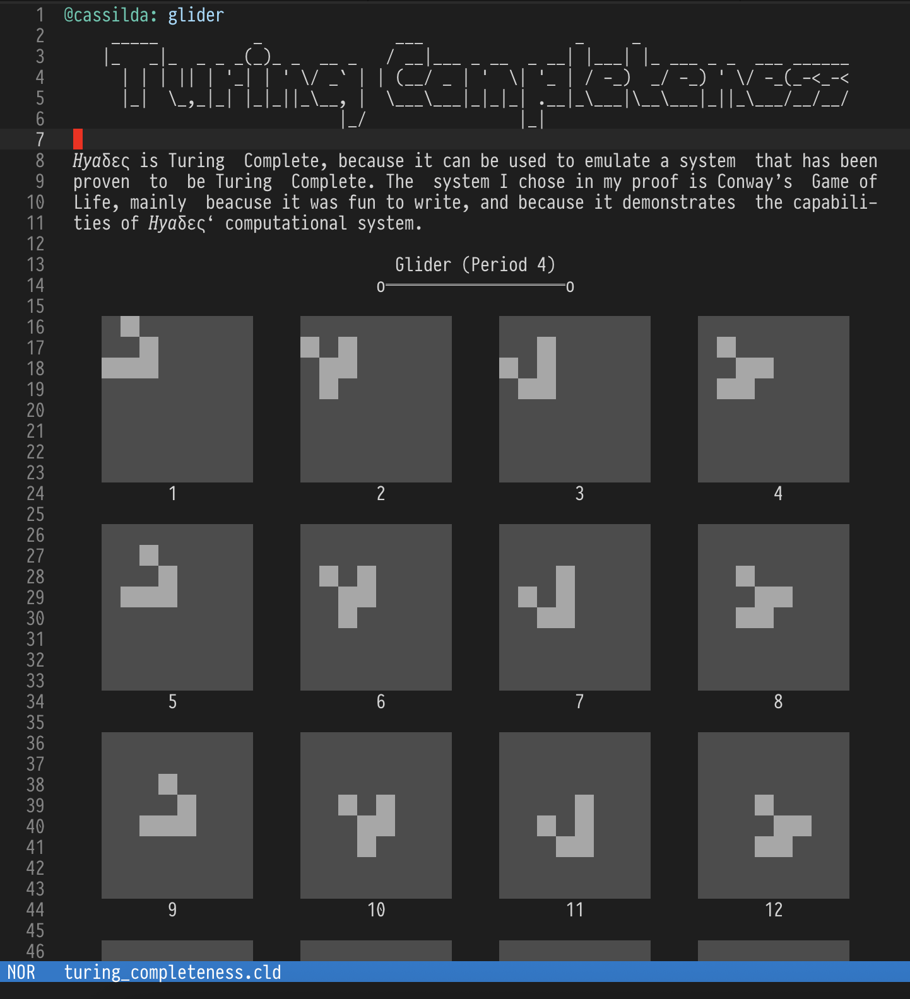
  <br>
</div>

## AI Disclosure

I started this project before the era of AI, so about half of it was made without it, and later Claude helped
me greatly to implement features that would take me weeks on my own, especially with a small baby to take care
of, and to bring this project to completion.